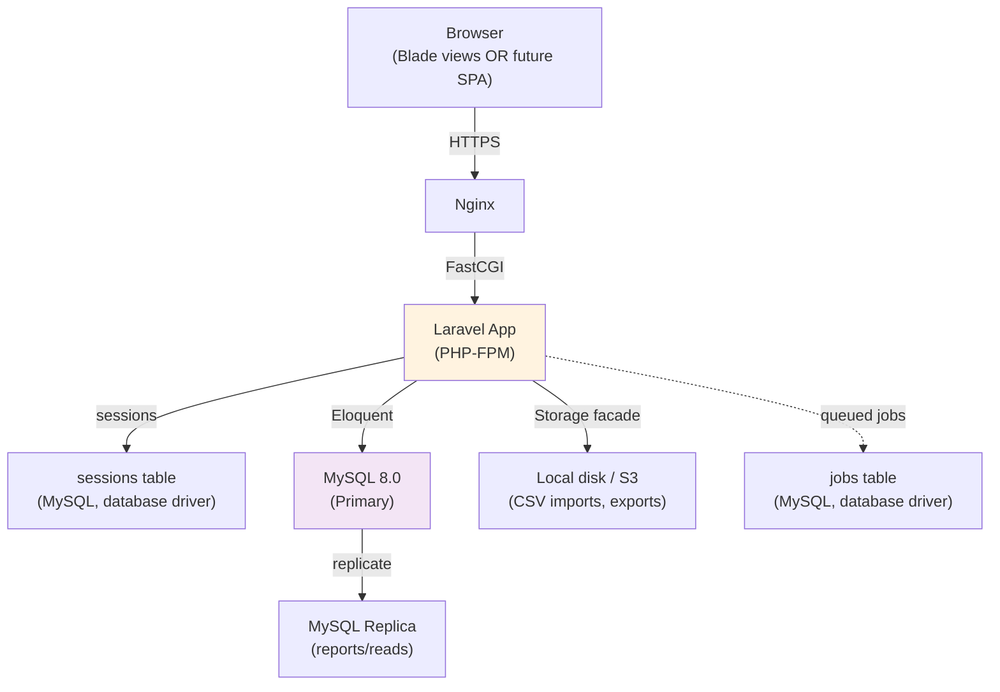

# ClassHub — System Architecture (PHP / Laravel / MySQL)

**Version**: 1.0
**Date**: August 25, 2026
**Stack**: Laravel (MVC), MySQL 8.0, Frontend TBD (dual-mode: server-rendered + API-ready)

---

## 1. Decisions Locked In

| Decision | Choice | Rationale |
|---|---|---|
| Framework | **Laravel** | Migrations, Eloquent ORM, Policies, Sanctum auth, Queue — all fit MVC + your RBAC matrix directly |
| Frontend mode | **Dual-mode** (web.php + api.php, shared Controllers/Services) | Frontend undecided; avoids throwaway work either direction |
| Session/Queue driver | **`database`** (not Redis) | Single-server deployment, no extra infra to operate |
| Primary keys | **BIGINT AUTO_INCREMENT** (not UUID) | Simpler MySQL indexing at single-school/single-tenant scale |
| RBAC enforcement | **Laravel Policies** (app layer only) | MySQL has no Postgres-style Row-Level Security; Policies are the single, testable enforcement point |
| Grade recalculation | **Model Observer** (not DB trigger) | Testable in PHPUnit, visible in stack traces, negligible perf cost at this scale |
| MySQL version requirement | **8.0.16+** | Needed for native `CHECK` constraints and `JSON` column indexing |

---

## 2. Architecture Diagram



**Single-server deployment** (implied by native sessions):
```
[Nginx] → [PHP-FPM (Laravel)] → [MySQL 8.0]
                ↓
        [Queue Worker]   php artisan queue:work (via Supervisor)
        [Scheduler]      cron: * * * * * php artisan schedule:run
```

---

## 3. Directory Structure

```
app/
├── Http/
│   ├── Controllers/
│   │   ├── Api/
│   │   │   ├── KhoiController.php
│   │   │   ├── LopController.php
│   │   │   ├── StudentController.php
│   │   │   ├── TeacherController.php
│   │   │   ├── EnrollmentController.php
│   │   │   ├── ScheduleController.php
│   │   │   ├── GradeController.php          # CORE
│   │   │   └── ReportController.php
│   │   └── Web/                             # mirror set, returns Blade views
│   └── Requests/
│       ├── StoreScoreRequest.php
│       ├── EnrollStudentRequest.php
│       ├── StoreLopRequest.php
│       └── BulkImportStudentsRequest.php
├── Models/
│   ├── School.php / User.php
│   ├── Khoi.php / Lop.php
│   ├── Student.php / Teacher.php
│   ├── Enrollment.php / Schedule.php
│   ├── AssessmentType.php
│   ├── Score.php / FinalGrade.php
│   └── AuditLog.php
├── Policies/
│   ├── KhoiPolicy.php
│   ├── LopPolicy.php
│   ├── StudentPolicy.php
│   ├── EnrollmentPolicy.php
│   └── GradePolicy.php
├── Services/
│   ├── GradeCalculationService.php
│   ├── EnrollmentValidationService.php
│   ├── BulkImportService.php
│   └── AuditLogService.php
└── Observers/
    ├── ScoreObserver.php
    └── EnrollmentObserver.php

routes/
├── web.php
└── api.php

database/
└── migrations/   (Section 5)
```

---

## 4. Routing Pattern (Dual-Mode)

```php
// routes/api.php
Route::middleware('auth:sanctum')->group(function () {
    Route::apiResource('khoi', Api\KhoiController::class);
    Route::apiResource('lop', Api\LopController::class);
    Route::apiResource('students', Api\StudentController::class);
    Route::post('students/bulk-import', [Api\StudentController::class, 'bulkImport']);
    Route::apiResource('lop.enrollments', Api\EnrollmentController::class)->shallow();
    Route::post('lop/{lop}/scores', [Api\GradeController::class, 'store']);
    Route::put('scores/{score}', [Api\GradeController::class, 'update']);
    Route::post('lop/{lop}/grades/publish', [Api\GradeController::class, 'publish']);
    Route::post('lop/{lop}/grades/unpublish', [Api\GradeController::class, 'unpublish']);
    Route::get('me/grades', [Api\GradeController::class, 'myGrades']);
});
```

```php
// routes/web.php  (only exercised if server-rendered frontend is chosen)
Route::middleware('auth')->group(function () {
    Route::resource('lop', Web\LopController::class);
    Route::get('lop/{lop}/grades', [Web\GradeController::class, 'index']);
    Route::post('lop/{lop}/scores', [Web\GradeController::class, 'store']);
    // ...mirrors api.php, returns Blade views instead of JSON
});
```

Controllers stay thin; both route files call the same **Services** — no duplicated business logic.

```php
class GradeController extends Controller
{
    public function store(StoreScoreRequest $r, GradeCalculationService $svc)
    {
        $this->authorize('enter', [Score::class, $r->lop]);
        $score = Score::updateOrCreate(
            ['student_id' => $r->student_id, 'lop_id' => $r->lop_id, 'assessment_type_id' => $r->assessment_type_id],
            ['numeric_score' => $r->numeric_score, 'teacher_id' => auth()->user()->teacher->id, 'created_by' => auth()->id()]
        );
        // ScoreObserver handles recalculation + audit log automatically on save

        return $r->wantsJson()
            ? response()->json($score->fresh('finalGrade'), 201)
            : back()->with('score', $score);
    }
}
```

---

## 5. Database Migrations (all 12 tables)

```php
// 0001_create_schools_table.php
Schema::create('schools', function (Blueprint $table) {
    $table->id();
    $table->string('name', 100);
    $table->string('email', 100)->unique();
    $table->string('phone', 20)->nullable();
    $table->string('address', 255)->nullable();
    $table->enum('tier', ['Starter','Professional','School','Enterprise'])->default('Starter');
    $table->enum('subscription_status', ['trial','active','suspended','canceled'])->default('trial');
    $table->timestamp('subscription_expires_at')->nullable();
    $table->timestamps();
});

// 0002_create_users_table.php
Schema::create('users', function (Blueprint $table) {
    $table->id();
    $table->foreignId('school_id')->constrained()->cascadeOnDelete();
    $table->string('username', 50);
    $table->string('email', 100)->nullable();
    $table->string('password');
    $table->enum('role', ['Admin','Staff','Teacher','Student']);
    $table->boolean('is_active')->default(true);
    $table->timestamp('last_login')->nullable();
    $table->rememberToken();
    $table->timestamps();

    $table->unique(['school_id', 'username']);
});

// 0003_create_khoi_table.php
Schema::create('khoi', function (Blueprint $table) {
    $table->id();
    $table->foreignId('school_id')->constrained()->cascadeOnDelete();
    $table->string('name', 50);
    $table->string('academic_year', 10);
    $table->boolean('is_active')->default(true);
    $table->foreignId('created_by')->constrained('users');
    $table->timestamps();

    $table->unique(['school_id', 'name', 'academic_year']);
});

// 0004_create_teachers_table.php  (created before lop, since lop.teacher_id references it)
Schema::create('teachers', function (Blueprint $table) {
    $table->id();
    $table->foreignId('school_id')->constrained()->cascadeOnDelete();
    $table->foreignId('user_id')->constrained()->cascadeOnDelete();
    $table->string('full_name', 100);
    $table->string('employee_id', 20);
    $table->string('subject', 50)->nullable();
    $table->enum('status', ['Active','On leave','Retired','Inactive'])->default('Active');
    $table->timestamps();

    $table->unique(['school_id', 'employee_id']);
});

// 0005_create_lop_table.php
Schema::create('lop', function (Blueprint $table) {
    $table->id();
    $table->foreignId('khoi_id')->constrained('khoi')->cascadeOnDelete();
    $table->foreignId('school_id')->constrained();
    $table->foreignId('teacher_id')->nullable()->constrained('teachers')->nullOnDelete();
    $table->string('name', 20);
    $table->unsignedInteger('max_capacity')->default(50);
    $table->unsignedInteger('current_enrollment')->default(0);
    $table->enum('status', ['Planning','Active','Archived'])->default('Planning');
    $table->timestamps();

    $table->unique(['khoi_id', 'name']);
});
DB::statement('ALTER TABLE lop ADD CONSTRAINT chk_capacity CHECK (max_capacity BETWEEN 10 AND 200)');

// 0006_create_students_table.php
Schema::create('students', function (Blueprint $table) {
    $table->id();
    $table->foreignId('school_id')->constrained()->cascadeOnDelete();
    $table->foreignId('user_id')->constrained()->cascadeOnDelete();
    $table->string('full_name', 100);
    $table->string('student_id', 20);
    $table->date('date_of_birth');
    $table->string('email', 100)->nullable();
    $table->string('phone', 20)->nullable();
    $table->enum('status', ['Active','Inactive','Graduated','Transferred'])->default('Active');
    $table->timestamps();

    $table->unique(['school_id', 'student_id']);
});

// 0007_create_enrollments_table.php
Schema::create('enrollments', function (Blueprint $table) {
    $table->id();
    $table->foreignId('school_id')->constrained();
    $table->foreignId('student_id')->constrained()->cascadeOnDelete();
    $table->foreignId('lop_id')->constrained('lop')->cascadeOnDelete();
    $table->string('academic_year', 10);
    $table->date('enrollment_date')->useCurrent();
    $table->enum('status', ['Enrolled','Inactive','Dropped','Graduated'])->default('Enrolled');
    $table->foreignId('created_by')->constrained('users');
    $table->timestamps();

    $table->unique(['student_id', 'lop_id', 'academic_year']);
});

// 0008_create_schedules_table.php
Schema::create('schedules', function (Blueprint $table) {
    $table->id();
    $table->foreignId('lop_id')->constrained('lop')->cascadeOnDelete();
    $table->foreignId('school_id')->constrained();
    $table->json('days_of_week');                 // e.g. ["Mon","Wed","Fri"]
    $table->time('start_time')->default('07:00:00');
    $table->time('end_time')->default('12:30:00');
    $table->string('location', 100)->nullable();
    $table->timestamps();

    $table->unique('lop_id');
});

// 0009_create_assessment_types_table.php
Schema::create('assessment_types', function (Blueprint $table) {
    $table->id();
    $table->foreignId('school_id')->constrained()->cascadeOnDelete();
    $table->string('name', 50);
    $table->decimal('weight', 5, 2);
    $table->boolean('is_enabled')->default(true);
    $table->timestamps();
});
DB::statement('ALTER TABLE assessment_types ADD CONSTRAINT chk_weight CHECK (weight BETWEEN 0 AND 100)');

// 0010_create_scores_table.php
Schema::create('scores', function (Blueprint $table) {
    $table->id();
    $table->foreignId('student_id')->constrained()->cascadeOnDelete();
    $table->foreignId('lop_id')->constrained('lop')->cascadeOnDelete();
    $table->foreignId('assessment_type_id')->constrained();
    $table->foreignId('teacher_id')->constrained('teachers');
    $table->foreignId('school_id')->constrained();
    $table->decimal('numeric_score', 4, 2)->nullable();
    $table->string('notes', 255)->nullable();
    $table->boolean('is_verified')->default(false);
    $table->foreignId('created_by')->constrained('users');
    $table->timestamps();

    $table->unique(['student_id', 'lop_id', 'assessment_type_id']);
});
DB::statement('ALTER TABLE scores ADD CONSTRAINT chk_score CHECK (numeric_score IS NULL OR numeric_score BETWEEN 0 AND 10)');

// 0011_create_final_grades_table.php
Schema::create('final_grades', function (Blueprint $table) {
    $table->id();
    $table->foreignId('student_id')->constrained()->cascadeOnDelete();
    $table->foreignId('lop_id')->constrained('lop')->cascadeOnDelete();
    $table->foreignId('school_id')->constrained();
    $table->string('academic_year', 10);
    $table->decimal('final_score', 4, 2)->nullable();
    $table->boolean('is_complete')->default(false);
    $table->enum('pass_status', ['Pass','Fail','Incomplete'])->default('Incomplete');
    $table->timestamp('published_at')->nullable();
    $table->foreignId('published_by')->nullable()->constrained('users');
    $table->timestamps();

    $table->unique(['student_id', 'lop_id', 'academic_year']);
});

// 0012_create_audit_logs_table.php
Schema::create('audit_logs', function (Blueprint $table) {
    $table->id();
    $table->foreignId('school_id')->constrained();
    $table->foreignId('user_id')->constrained();
    $table->string('action', 50);
    $table->string('entity_type', 50);
    $table->unsignedBigInteger('entity_id')->nullable();
    $table->json('changes')->nullable();
    $table->string('ip_address', 45)->nullable();
    $table->timestamp('created_at')->useCurrent();

    $table->index(['entity_type', 'entity_id']);
    $table->index('created_at');
});
```

---

## 6. Policy Stubs (RBAC — direct mapping from permission matrix)

```php
// app/Policies/LopPolicy.php
class LopPolicy
{
    public function create(User $user): bool
    {
        return $user->role === 'Admin';
    }

    public function assignTeacher(User $user): bool
    {
        return $user->role === 'Admin';
    }

    public function view(User $user, Lop $lop): bool
    {
        return match ($user->role) {
            'Admin', 'Staff' => true,
            'Teacher' => $lop->teacher_id === $user->teacher?->id,
            'Student' => $user->student?->enrollments()->where('lop_id', $lop->id)->exists(),
            default => false,
        };
    }
}

// app/Policies/EnrollmentPolicy.php
class EnrollmentPolicy
{
    public function create(User $user): bool
    {
        return in_array($user->role, ['Admin', 'Staff']);
    }

    public function delete(User $user): bool
    {
        return in_array($user->role, ['Admin', 'Staff']);
    }
}

// app/Policies/GradePolicy.php
class GradePolicy
{
    public function enter(User $user, Lop $lop): bool
    {
        return $user->role === 'Admin'
            || ($user->role === 'Teacher' && $lop->teacher_id === $user->teacher?->id);
    }

    public function publish(User $user, Lop $lop): bool
    {
        return $this->enter($user, $lop);  // same rule per your matrix
    }

    public function correct(User $user, Score $score): bool
    {
        return $user->role === 'Admin'
            || ($user->role === 'Teacher' && $score->lop->teacher_id === $user->teacher?->id);
    }

    public function viewAll(User $user): bool
    {
        return $user->role === 'Admin';
    }

    public function viewOwn(User $user, FinalGrade $grade): bool
    {
        return $user->role === 'Student' && $grade->student_id === $user->student?->id;
    }
}

// app/Policies/StudentPolicy.php
class StudentPolicy
{
    public function create(User $user): bool
    {
        return in_array($user->role, ['Admin', 'Staff']);
    }

    public function bulkImport(User $user): bool
    {
        return in_array($user->role, ['Admin', 'Staff']);
    }
}
```

```php
// app/Providers/AuthServiceProvider.php
protected $policies = [
    Lop::class => LopPolicy::class,
    Enrollment::class => EnrollmentPolicy::class,
    Score::class => GradePolicy::class,
    Student::class => StudentPolicy::class,
];
```

**Test coverage requirement** (mitigates the "no DB-level RLS" risk): one PHPUnit test class per Policy, asserting all 4 roles × every method — e.g. `GradePolicyTest` must assert a Student is denied `enter()`, a Teacher is denied `enter()` on another teacher's Lớp, etc. This becomes your primary defense layer since MySQL can't enforce it at the DB level.

---

## 7. Grade Recalculation — Observer Pattern

```php
// app/Observers/ScoreObserver.php
class ScoreObserver
{
    public function saved(Score $score): void
    {
        app(GradeCalculationService::class)->recalculate($score->student_id, $score->lop_id);
        app(AuditLogService::class)->log(
            action: $score->wasRecentlyCreated ? 'entered_score' : 'corrected_score',
            model: $score,
            changes: $score->getChanges()
        );
    }
}

// app/Providers/AppServiceProvider.php (boot method)
Score::observe(ScoreObserver::class);
```

```php
// app/Services/GradeCalculationService.php
class GradeCalculationService
{
    public function recalculate(int $studentId, int $lopId): FinalGrade
    {
        $total = Score::query()
            ->where('student_id', $studentId)
            ->where('lop_id', $lopId)
            ->join('assessment_types', 'scores.assessment_type_id', '=', 'assessment_types.id')
            ->whereNotNull('numeric_score')
            ->sum(DB::raw('numeric_score * weight / 100'));

        $enrollment = Enrollment::where('student_id', $studentId)->where('lop_id', $lopId)->firstOrFail();

        return FinalGrade::updateOrCreate(
            ['student_id' => $studentId, 'lop_id' => $lopId, 'academic_year' => $enrollment->academic_year],
            [
                'school_id' => $enrollment->school_id,
                'final_score' => $total,
                'pass_status' => $total >= 5.0 ? 'Pass' : 'Fail',
            ]
        );
    }
}
```

---

## 8. Enrollment Validation Service

```php
// app/Services/EnrollmentValidationService.php
class EnrollmentValidationService
{
    public function enroll(Student $student, Lop $lop, string $academicYear): Enrollment
    {
        if ($student->status !== 'Active') {
            throw new BusinessRuleException('Student is not active', 'STUDENT_INACTIVE');
        }
        if (Enrollment::where('student_id', $student->id)
            ->where('academic_year', $academicYear)
            ->where('status', 'Enrolled')
            ->exists()) {
            throw new BusinessRuleException('Student already enrolled this year', 'DUPLICATE_ENROLLMENT');
        }
        if ($lop->current_enrollment >= $lop->max_capacity) {
            throw new BusinessRuleException('Lớp at capacity', 'CAPACITY_EXCEEDED');
        }

        return DB::transaction(function () use ($student, $lop, $academicYear) {
            $enrollment = Enrollment::create([
                'student_id' => $student->id,
                'lop_id' => $lop->id,
                'school_id' => $lop->school_id,
                'academic_year' => $academicYear,
                'created_by' => auth()->id(),
            ]);
            $lop->increment('current_enrollment');
            app(AuditLogService::class)->log('enrolled_student', $enrollment);

            return $enrollment;
        });
    }
}
```

---

## 9. Architecture Decision Records (Final)

| # | Decision | Status |
|---|---|---|
| ADR-1 | Laravel as the framework | ✅ Decided |
| ADR-2 | Dual-mode routing (web.php + api.php, shared Services) | ✅ Decided — revisit once frontend chosen |
| ADR-3 | BIGINT AUTO_INCREMENT PKs over UUID | ✅ Decided |
| ADR-4 | `database` driver for sessions/queue (not Redis) | ✅ Decided — **constraint**: single-server only; revisit before horizontal scaling or multi-school Enterprise tier |
| ADR-5 | Model Observers over MySQL triggers | ✅ Decided |
| ADR-6 | Policies as sole RBAC enforcement (no DB-level RLS) | ✅ Decided — **mitigation**: full PHPUnit coverage per Policy class |
| ADR-7 | MySQL 8.0.16+ required | ✅ Decided — flag to infra/DBA before provisioning |

---

## 10. Open Item

**Frontend framework** is the only undecided piece. Everything above is built so either choice (Blade/Twig server-rendered, or a separate SPA consuming `api.php` via Sanctum tokens) requires no rework — just finalize routing (`web.php` vs `api.php`) once decided.

---

*Prepared for ClassHub — Vietnamese secondary school grade management SaaS*
*Stack: Laravel MVC + MySQL 8.0*
